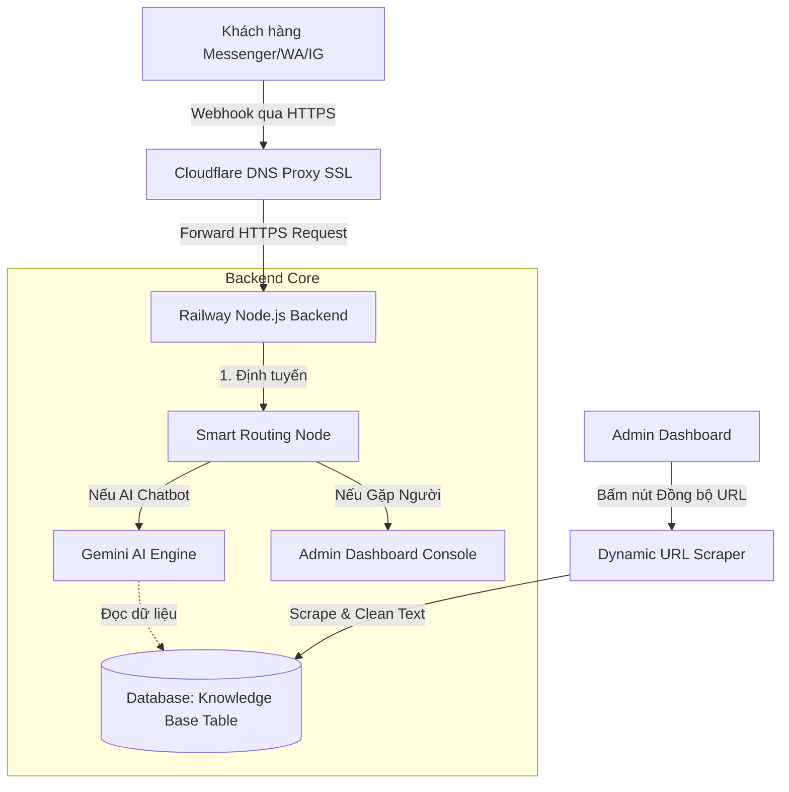

# Kế Hoạch Triển Khai: Xây Dựng Backend, Cơ Sở Dữ Liệu Đa Dự Án, Tích Hợp Đa Kênh & Đồng Bộ Tri Thức Tự Động (Gemini AI)

Tài liệu này vạch ra kế hoạch xây dựng một hệ thống **Backend độc lập (Node.js/Express)** kèm **Cơ sở dữ liệu (PostgreSQL)**, hỗ trợ đa dự án (Multi-tenant), đồng thời đi sâu chi tiết vào **Phương án B (Tích hợp API Meta & WhatsApp Cloud trực tiếp)** kết hợp với giải pháp **Crawl nội dung Landing Page tự động** để đồng bộ cơ sở tri thức cho Gemini AI.

---

## 🌟 Tổng quan Kiến trúc & Xác thực SSL (Railway + Cloudflare)

* **Xác thực HTTPS (SSL)**:
  * **Railway** tự động cấp chứng chỉ SSL (HTTPS) cho mọi tên miền mặc định (`*.up.railway.app`).
  * **Cloudflare** hoạt động như một Reverse Proxy bảo mật, tự động quản lý chứng chỉ SSL/TLS Edge cho tên miền riêng của bạn.
  * ➡️ **Kết luận**: Môi trường của bạn **hoàn toàn có sẵn HTTPS (SSL) chất lượng cao**, đáp ứng 100% tiêu chuẩn bảo mật khắt khe của Meta Webhook mà không cần cấu hình thêm bất kỳ chứng chỉ thủ công nào.



---

## 1. Thiết Kế Cơ Sơ Dữ Liệu Nâng Cấp (PostgreSQL Schema)

Chúng ta cấu hình cơ sở dữ liệu **PostgreSQL** để hỗ trợ tính năng đa kênh (Facebook Messenger, Instagram, WhatsApp) trực tiếp.

### Bảng `sessions` (Quản lý phiên chat)
*   `id` (TEXT, Khóa chính) - Mã định danh phiên chat (UUID hoặc chuỗi định danh đa kênh).
*   `project_id` (VARCHAR(100)) - Định danh dự án (Ví dụ: `pastie-landingpage`).
*   `visitor_name` (VARCHAR(255))
*   `visitor_email` (VARCHAR(255))
*   `detected_language` (VARCHAR(10)) - Ngôn ngữ AI tự phát hiện.
*   `ai_summary` (TEXT) - Tóm tắt hội thoại tự động bằng AI.
*   `intent_tags` (TEXT) - Danh sách các thẻ ý định ngăn cách bằng dấu phẩy.
*   `is_verified` (BOOLEAN, Default FALSE) - Trạng thái xác thực OTP.
*   `status` (VARCHAR(20), Default 'active') - Trạng thái phiên chat (`active`, `closed`).
*   `platform` (VARCHAR(20) DEFAULT 'widget') - Nền tảng gốc (`widget`, `messenger`, `whatsapp`, `instagram`).
*   `platform_sender_id` (VARCHAR(100)) - Số điện thoại WhatsApp hoặc ID người dùng Facebook (PSID).
*   `created_at` (TIMESTAMP, Default CURRENT_TIMESTAMP)

### Bảng `messages` (Chi tiết tin nhắn)
*   `id` (SERIAL, Khóa chính)
*   `session_id` (TEXT, Khóa ngoại) - Liên kết với `sessions(id)` ON DELETE CASCADE.
*   `sender` (VARCHAR(20)) - Người gửi (`visitor`, `agent`, `system`).
*   `original_text` (TEXT) - Tin nhắn gốc.
*   `translated_text` (TEXT) - Tin nhắn đã dịch qua AI.
*   `language` (VARCHAR(10)) - Ngôn ngữ của tin nhắn gốc.
*   `created_at` (TIMESTAMP, Default CURRENT_TIMESTAMP)

### Bảng `knowledge_base` (Cơ sở tri thức AI)
*   `id` (SERIAL, Khóa chính)
*   `project_id` (VARCHAR(100)) - Lọc theo dự án.
*   `source_url` (TEXT) - URL nguồn cào.
*   `raw_html` (TEXT) - HTML gốc.
*   `cleaned_content` (TEXT) - Nội dung chữ đã loại bỏ thẻ rác để làm context cho Gemini.
*   `updated_at` (TIMESTAMP)

---

## 2. API Webhook & Trích Xuất Đa Kênh

### A. Webhook Verification Endpoint (`server.js`)
Cung cấp route `GET` để cấu hình webhook trên Meta Developer Console:

```javascript
app.get('/api/multichannel/webhook', (req, res) => {
  const VERIFY_TOKEN = process.env.META_VERIFY_TOKEN || 'PastieVerifyToken2026';
  
  const mode = req.query['hub.mode'];
  const token = req.query['hub.verify_token'];
  const challenge = req.query['hub.challenge'];
  
  if (mode && token) {
    if (mode === 'subscribe' && token === VERIFY_TOKEN) {
      console.log('WEBHOOK_VERIFIED successfully with Meta!');
      return res.status(200).send(challenge);
    } else {
      return res.sendStatus(403);
    }
  }
  res.sendStatus(400);
});
```

### B. Hàm Trích Xuất Dữ Liệu Webhook
Meta gửi sự kiện Messenger/Instagram và WhatsApp bằng cấu hình payload khác nhau. Ta cần chuẩn hóa dữ liệu:

```javascript
function parseWebhookEvent(body) {
  // 1. WhatsApp Cloud API Payload
  if (body.object === 'whatsapp_business_account') {
    const entry = body.entry?.[0];
    const change = entry?.changes?.[0]?.value;
    const message = change?.messages?.[0];
    if (message) {
      return {
        platform: 'whatsapp',
        senderId: message.from, // Số điện thoại khách hàng
        name: change.contacts?.[0]?.profile?.name || `WhatsApp User (${message.from})`,
        text: message.text?.body || '[Media/Image]',
        messageId: message.id
      };
    }
  }

  // 2. Facebook Messenger / Instagram
  if (body.object === 'page' || body.object === 'instagram') {
    const entry = body.entry?.[0];
    const messaging = entry?.messaging?.[0];
    if (messaging && messaging.message) {
      const isInstagram = body.object === 'instagram';
      return {
        platform: isInstagram ? 'instagram' : 'messenger',
        senderId: messaging.sender.id,
        name: `Khách hàng ${isInstagram ? 'Instagram' : 'Facebook'}`,
        text: messaging.message.text || '[Media/Image]',
        messageId: messaging.message.mid
      };
    }
  }
  return null;
}
```

### C. Gửi Tin Nhắn Phản Hồi (Send API Wrappers)
Server sử dụng các hàm helper này để gọi API của Meta trả về tin nhắn cho khách hàng:

```javascript
const axios = require('axios');

async function sendMultichannelMessage(platform, recipientId, text) {
  try {
    if (platform === 'whatsapp') {
      const whatsappPhoneId = process.env.WHATSAPP_PHONE_NUMBER_ID;
      const whatsappToken = process.env.WHATSAPP_ACCESS_TOKEN;
      
      const url = `https://graph.facebook.com/v20.0/${whatsappPhoneId}/messages`;
      await axios.post(url, {
        messaging_product: "whatsapp",
        recipient_type: "individual",
        to: recipientId,
        type: "text",
        text: { body: text }
      }, {
        headers: { 'Authorization': `Bearer ${whatsappToken}`, 'Content-Type': 'application/json' }
      });
      console.log(`WhatsApp message sent to ${recipientId}`);
    } 
    
    else if (platform === 'messenger' || platform === 'instagram') {
      const pageToken = platform === 'instagram' 
        ? process.env.INSTAGRAM_ACCESS_TOKEN 
        : process.env.MESSENGER_PAGE_ACCESS_TOKEN;
        
      const url = `https://graph.facebook.com/v20.0/me/messages?access_token=${pageToken}`;
      await axios.post(url, {
        recipient: { id: recipientId },
        message: { text: text }
      });
      console.log(`${platform} message sent to ${recipientId}`);
    }
  } catch (error) {
    console.error(`Error sending message to ${platform}:`, error.response?.data || error.message);
  }
}
```

---

## 3. Cơ Chế Thu Thập & Đồng Bộ Tri Thức Tự Động (Landing Page Scraper)

Thay vì nhập liệu thủ công từng FAQ, chúng ta sẽ xây dựng một Web Scraper tự động giúp biến đổi Landing Page thành Context cho AI.

### A. API Endpoint Đồng bộ Tri thức từ Landing Page (`POST /api/admin/knowledge/sync`)
```javascript
const axios = require('axios');

app.post('/api/admin/knowledge/sync', checkAdminAuth, async (req, res) => {
  const { url, projectId = 'pastie-landingpage' } = req.body;
  if (!url) {
    return res.status(400).json({ error: 'Thiếu tham số URL.' });
  }

  try {
    console.log(`Đang cào dữ liệu tri thức từ: ${url}`);
    
    const response = await axios.get(url, {
      headers: {
        'User-Agent': 'Mozilla/5.0 (Windows NT 10.0; Win64; x64) AppleWebKit/537.36'
      }
    });
    
    const html = response.data;
    const cleanedContent = cleanHtmlToText(html);
    
    // Lưu vào cơ sở dữ liệu
    await db.query(`
      INSERT INTO knowledge_base (project_id, source_url, raw_html, cleaned_content)
      VALUES ($1, $2, $3, $4)
      ON CONFLICT (id) DO UPDATE 
      SET raw_html = EXCLUDED.raw_html, cleaned_content = EXCLUDED.cleaned_content
    `, [projectId, url, html, cleanedContent]);

    res.json({ 
      success: true, 
      message: 'Cập nhật cơ sở tri thức thành công!',
      characterCount: cleanedContent.length
    });
  } catch (error) {
    console.error('Scrape error:', error.message);
    res.status(500).json({ error: 'Không thể thu thập dữ liệu từ URL này.' });
  }
});

// Hàm dọn dẹp các thẻ rác, style và script từ HTML
function cleanHtmlToText(html) {
  let text = html.replace(/<script[^>]*>([\s\S]*?)<\/script>/gi, '');
  text = text.replace(/<style[^>]*>([\s\S]*?)<\/style>/gi, '');
  text = text.replace(/<[^>]+>/g, ' ');
  text = text.replace(/\s+/g, ' ').trim();
  return text;
}
```

### B. Tích Hợp Vào Prompt Gemini AI Chatbot
Khi có tin nhắn mới từ khách hàng đa kênh, hệ thống sẽ truy cập cơ sở tri thức mới nhất từ database và đưa vào ngữ cảnh chỉ dẫn cho Gemini:

```javascript
async function getGeminiChatbotResponse(sessionId, userMessage) {
  // 1. Lấy lịch sử hội thoại gần nhất của session
  const historyRes = await db.query(
    `SELECT sender, original_text FROM messages WHERE session_id = $1 ORDER BY created_at ASC LIMIT 10`,
    [sessionId]
  );
  
  // 2. Tải cơ sở tri thức đã cào từ Landing Page
  const kbRes = await db.query(
    `SELECT cleaned_content FROM knowledge_base WHERE project_id = 'pastie-landingpage' ORDER BY updated_at DESC LIMIT 1`
  );
  
  const knowledgeContext = kbRes.rows[0]?.cleaned_content || "Không có tài liệu tri thức bổ sung.";

  // 3. Xây dựng System Instructions thông minh
  const systemInstruction = `
    Bạn là một trợ lý tư vấn dịch vụ du lịch và phòng nghỉ cao cấp cực kỳ chuyên nghiệp và thân thiện của thương hiệu Pastie.
    
    Hãy trả lời các câu hỏi của khách hàng một cách ngắn gọn, súc tích (dưới 3 câu) để hiển thị tốt nhất trên giao diện di động.
    Tự động giao tiếp bằng chính ngôn ngữ mà khách hàng đang sử dụng.
    
    Dưới đây là TOÀN BỘ CƠ SỞ TRI THỨC được lấy từ trang web chính thức của chúng tôi để bạn làm căn cứ tư vấn. CHỈ trả lời dựa trên tài liệu này, không tự bịa thông tin:
    
    === CƠ SỞ TRI THỨC CHÍNH THỨC ===
    ${knowledgeContext}
    === HẾT CƠ SỞ TRI THỨC ===
    
    Nếu thông tin khách hỏi nằm ngoài cơ sở tri thức trên, hãy khéo léo từ chối và đề xuất chuyển gặp nhân viên hỗ trợ trực tiếp.
  `;

  // 4. Gọi API Gemini
  const responseText = await callGeminiAPI(systemInstruction, historyRes.rows, userMessage);
  return responseText;
}
```

---

## 4. Quy Trình Bàn Giao Tự Động Giữa AI & Nhân Viên

1. **AI Chatbot**:
   * Khi khách hàng nhắn tin lần đầu, hệ thống tự nhận diện nền tảng và `platform_sender_id` để kiểm tra session `active` trong DB.
   * Nếu không có session nào đang hoạt động, tin nhắn được chuyển thẳng cho **Gemini AI** để trả lời dựa trên context đã crawl.
2. **Yêu cầu gặp Người**:
   * Khi khách hàng chat chứa từ khóa như *"nhân viên"*, *"gặp admin"* hoặc Gemini phát hiện khách hàng muốn gặp tư vấn viên:
   * Hệ thống cập nhật trạng thái session thành `active` và gửi cảnh báo nổi bật lên **Admin Dashboard**.
3. **Đồng bộ Dashboard & Đóng Chat**:
   * Khi Admin chọn và trả lời qua màn hình quản trị, tin nhắn được gửi ngược về Meta của khách hàng.
   * Khi Admin bấm **"Đóng cuộc chat" (Close Chat)**, session sẽ chuyển về `closed` và AI chatbot (Gemini) sẽ lập tức tiếp quản lại cuộc trò chuyện cho các tin nhắn sau đó.

---

## ❓ Câu Hỏi Thảo Luận Dành Cho Bạn

1. **Chu kỳ đồng bộ**: Bạn muốn việc đồng bộ tri thức từ URL diễn ra thủ công qua nút bấm trên Dashboard (khuyên dùng để kiểm soát dung lượng API) hay tự động quét 24h một lần?
